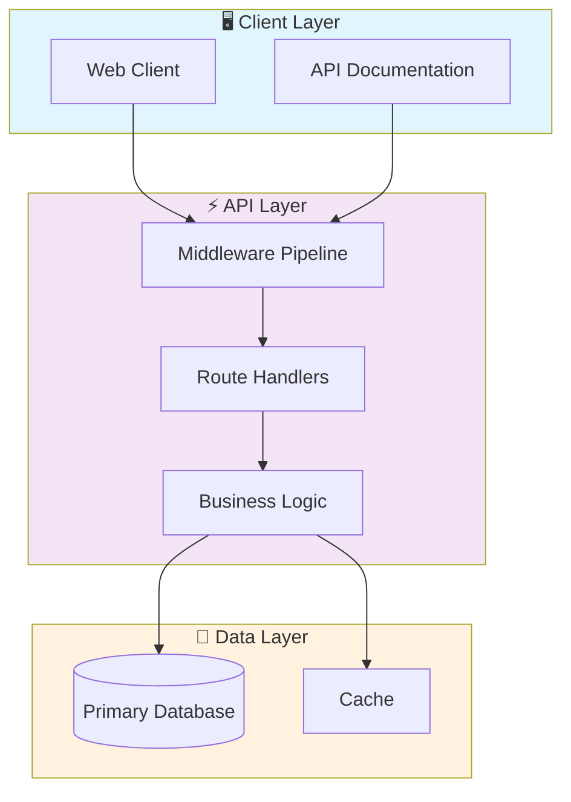
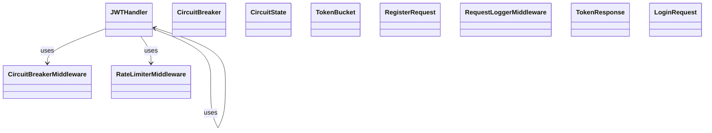

# 🔒 Secure Financial Api Gateway

> Secure API gateway designed for financial services. Features OAuth2/JWT authentication, rate limiting, request validation, TLS encryption, and comprehensive audit trails.

[](https://img.shields.io/badge/)
[](https://img.shields.io/badge/)
[](https://img.shields.io/badge/)
[](https://img.shields.io/badge/)
[](https://img.shields.io/badge/)
[](LICENSE)

[English](#english) | [Português](#português)

---

## English

### 🎯 Overview

**Secure Financial Api Gateway** is a production-grade Python application that showcases modern software engineering practices including clean architecture, comprehensive testing, containerized deployment, and CI/CD readiness.

The codebase comprises **1,183 lines** of source code organized across **22 modules**, following industry best practices for maintainability, scalability, and code quality.

### ✨ Key Features

- **🔒 Authentication**: JWT-based authentication with token refresh
- **🛡️ Authorization**: Role-based access control (RBAC)
- **🔐 Encryption**: AES-256 encryption for sensitive data
- **📝 Audit Logging**: Complete audit trail for all operations
- **⚡ Async API**: High-performance async REST API with FastAPI
- **📖 Auto-Documentation**: Interactive Swagger UI and ReDoc
- **✅ Validation**: Pydantic-powered request/response validation
- **🐳 Containerized**: Docker support for consistent deployment

### 🏗️ Architecture





### 📡 API Endpoints

| Method | Endpoint | Description |
|--------|----------|-------------|
| `GET` | `/` | Retrieve resource (list/create) |
| `GET` | `/health` | Retrieve Health |
| `GET` | `/users` | Retrieve Users |
| `POST` | `/login` | Create Login |
| `POST` | `/refresh` | Create Refresh |
| `GET` | `/me` | Retrieve Me |
| `POST` | `/logout` | Create Logout |
| `GET` | `/orders` | Retrieve Orders |
| `GET` | `/profile` | Retrieve Profile |

### 🚀 Quick Start

#### Prerequisites

- Python 3.12+
- pip (Python package manager)
- Docker and Docker Compose (optional)

#### Installation

```bash
# Clone the repository
git clone https://github.com/galafis/secure-financial-api-gateway.git
cd secure-financial-api-gateway

# Create and activate virtual environment
python -m venv venv
source venv/bin/activate  # On Windows: venv\Scripts\activate

# Install dependencies
pip install -r requirements.txt
```

#### Running

```bash
# Run the application
python src/main.py
```

### 🐳 Docker

```bash
# Start all services
docker-compose up -d

# View logs
docker-compose logs -f

# Stop all services
docker-compose down

# Rebuild after changes
docker-compose up -d --build
```

### 🧪 Testing

```bash
# Run all tests
pytest

# Run with coverage report
pytest --cov --cov-report=html

# Run specific test module
pytest tests/test_main.py -v

# Run with detailed output
pytest -v --tb=short
```

### 📁 Project Structure

```
secure-financial-api-gateway/
├── docs/          # Documentation
│   ├── FAQ.md
│   ├── USE_CASES.md
│   └── security.md
├── src/          # Source code
│   ├── auth/
│   │   ├── __init__.py
│   │   └── jwt_handler.py
│   ├── middleware/
│   │   ├── __init__.py
│   │   ├── circuit_breaker.py
│   │   ├── rate_limiter.py
│   │   ├── request_logger.py
│   │   └── security_headers.py
│   ├── routes/
│   │   ├── __init__.py
│   │   ├── admin_routes.py
│   │   ├── auth_routes.py
│   │   ├── trading_routes.py
│   │   └── user_routes.py
│   ├── utils/         # Utilities
│   │   ├── __init__.py
│   │   └── logger.py
│   ├── __init__.py
│   └── main.py
├── tests/         # Test suite
│   ├── test_admin.py
│   ├── test_auth.py
│   ├── test_health.py
│   ├── test_middleware.py
│   ├── test_trading.py
│   └── test_users.py
├── CONTRIBUTING.md
├── Dockerfile
├── LICENSE
├── Makefile
├── README.md
├── SECURITY.md
├── docker-compose.yml
├── pyproject.toml
└── requirements.txt
```

### 🔒 Security Considerations

| Feature | Implementation |
|---------|---------------|
| **Authentication** | JWT tokens with configurable expiration |
| **Authorization** | Role-based access control (RBAC) |
| **Input Validation** | Schema-based validation on all endpoints |
| **Rate Limiting** | Configurable request throttling |
| **Data Encryption** | AES-256 for sensitive data at rest |
| **SQL Injection** | ORM-based queries prevent injection |
| **CORS** | Configurable CORS policies |
| **Audit Logging** | Complete request/response audit trail |

> ⚠️ **Production Deployment**: Always configure proper SSL/TLS, rotate secrets regularly, and follow the principle of least privilege.

### 🛠️ Tech Stack

| Technology | Description | Role |
|------------|-------------|------|
| **Python** | Core Language | Primary |
| **Docker** | Containerization platform | Framework |
| **FastAPI** | High-performance async web framework | Framework |
| **JWT** | Token-based authentication | Framework |
| **Redis** | In-memory data store | Framework |

### 🚀 Deployment

#### Cloud Deployment Options

The application is containerized and ready for deployment on:

| Platform | Service | Notes |
|----------|---------|-------|
| **AWS** | ECS, EKS, EC2 | Full container support |
| **Google Cloud** | Cloud Run, GKE | Serverless option available |
| **Azure** | Container Instances, AKS | Enterprise integration |
| **DigitalOcean** | App Platform, Droplets | Cost-effective option |

```bash
# Production build
docker build -t secure-financial-api-gateway:latest .

# Tag for registry
docker tag secure-financial-api-gateway:latest registry.example.com/secure-financial-api-gateway:latest

# Push to registry
docker push registry.example.com/secure-financial-api-gateway:latest
```

### 🤝 Contributing

Contributions are welcome! Please feel free to submit a Pull Request. For major changes, please open an issue first to discuss what you would like to change.

1. Fork the project
2. Create your feature branch (`git checkout -b feature/AmazingFeature`)
3. Commit your changes (`git commit -m 'Add some AmazingFeature'`)
4. Push to the branch (`git push origin feature/AmazingFeature`)
5. Open a Pull Request

### 📄 License

This project is licensed under the MIT License - see the [LICENSE](LICENSE) file for details.

### 👤 Author

**Gabriel Demetrios Lafis**
- GitHub: [@galafis](https://github.com/galafis)
- LinkedIn: [Gabriel Demetrios Lafis](https://linkedin.com/in/gabriel-demetrios-lafis)

---

## Português

### 🎯 Visão Geral

**Secure Financial Api Gateway** é uma aplicação Python de nível profissional que demonstra práticas modernas de engenharia de software, incluindo arquitetura limpa, testes abrangentes, implantação containerizada e prontidão para CI/CD.

A base de código compreende **1,183 linhas** de código-fonte organizadas em **22 módulos**, seguindo as melhores práticas do setor para manutenibilidade, escalabilidade e qualidade de código.

### ✨ Funcionalidades Principais

- **🔒 Authentication**: JWT-based authentication with token refresh
- **🛡️ Authorization**: Role-based access control (RBAC)
- **🔐 Encryption**: AES-256 encryption for sensitive data
- **📝 Audit Logging**: Complete audit trail for all operations
- **⚡ Async API**: High-performance async REST API with FastAPI
- **📖 Auto-Documentation**: Interactive Swagger UI and ReDoc
- **✅ Validation**: Pydantic-powered request/response validation
- **🐳 Containerized**: Docker support for consistent deployment

### 🏗️ Arquitetura


### 📡 API Endpoints

| Method | Endpoint | Description |
|--------|----------|-------------|
| `GET` | `/` | Retrieve resource (list/create) |
| `GET` | `/health` | Retrieve Health |
| `GET` | `/users` | Retrieve Users |
| `POST` | `/login` | Create Login |
| `POST` | `/refresh` | Create Refresh |
| `GET` | `/me` | Retrieve Me |
| `POST` | `/logout` | Create Logout |
| `GET` | `/orders` | Retrieve Orders |
| `GET` | `/profile` | Retrieve Profile |

### 🚀 Início Rápido

#### Prerequisites

- Python 3.12+
- pip (Python package manager)
- Docker and Docker Compose (optional)

#### Installation

```bash
# Clone the repository
git clone https://github.com/galafis/secure-financial-api-gateway.git
cd secure-financial-api-gateway

# Create and activate virtual environment
python -m venv venv
source venv/bin/activate  # On Windows: venv\Scripts\activate

# Install dependencies
pip install -r requirements.txt
```

#### Running

```bash
# Run the application
python src/main.py
```

### 🐳 Docker

```bash
# Start all services
docker-compose up -d

# View logs
docker-compose logs -f

# Stop all services
docker-compose down

# Rebuild after changes
docker-compose up -d --build
```

### 🧪 Testing

```bash
# Run all tests
pytest

# Run with coverage report
pytest --cov --cov-report=html

# Run specific test module
pytest tests/test_main.py -v

# Run with detailed output
pytest -v --tb=short
```

### 📁 Estrutura do Projeto

```
secure-financial-api-gateway/
├── docs/          # Documentation
│   ├── FAQ.md
│   ├── USE_CASES.md
│   └── security.md
├── src/          # Source code
│   ├── auth/
│   │   ├── __init__.py
│   │   └── jwt_handler.py
│   ├── middleware/
│   │   ├── __init__.py
│   │   ├── circuit_breaker.py
│   │   ├── rate_limiter.py
│   │   ├── request_logger.py
│   │   └── security_headers.py
│   ├── routes/
│   │   ├── __init__.py
│   │   ├── admin_routes.py
│   │   ├── auth_routes.py
│   │   ├── trading_routes.py
│   │   └── user_routes.py
│   ├── utils/         # Utilities
│   │   ├── __init__.py
│   │   └── logger.py
│   ├── __init__.py
│   └── main.py
├── tests/         # Test suite
│   ├── test_admin.py
│   ├── test_auth.py
│   ├── test_health.py
│   ├── test_middleware.py
│   ├── test_trading.py
│   └── test_users.py
├── CONTRIBUTING.md
├── Dockerfile
├── LICENSE
├── Makefile
├── README.md
├── SECURITY.md
├── docker-compose.yml
├── pyproject.toml
└── requirements.txt
```

### 🔒 Security Considerations

| Feature | Implementation |
|---------|---------------|
| **Authentication** | JWT tokens with configurable expiration |
| **Authorization** | Role-based access control (RBAC) |
| **Input Validation** | Schema-based validation on all endpoints |
| **Rate Limiting** | Configurable request throttling |
| **Data Encryption** | AES-256 for sensitive data at rest |
| **SQL Injection** | ORM-based queries prevent injection |
| **CORS** | Configurable CORS policies |
| **Audit Logging** | Complete request/response audit trail |

> ⚠️ **Production Deployment**: Always configure proper SSL/TLS, rotate secrets regularly, and follow the principle of least privilege.

### 🛠️ Stack Tecnológica

| Tecnologia | Descrição | Papel |
|------------|-----------|-------|
| **Python** | Core Language | Primary |
| **Docker** | Containerization platform | Framework |
| **FastAPI** | High-performance async web framework | Framework |
| **JWT** | Token-based authentication | Framework |
| **Redis** | In-memory data store | Framework |

### 🚀 Deployment

#### Cloud Deployment Options

The application is containerized and ready for deployment on:

| Platform | Service | Notes |
|----------|---------|-------|
| **AWS** | ECS, EKS, EC2 | Full container support |
| **Google Cloud** | Cloud Run, GKE | Serverless option available |
| **Azure** | Container Instances, AKS | Enterprise integration |
| **DigitalOcean** | App Platform, Droplets | Cost-effective option |

```bash
# Production build
docker build -t secure-financial-api-gateway:latest .

# Tag for registry
docker tag secure-financial-api-gateway:latest registry.example.com/secure-financial-api-gateway:latest

# Push to registry
docker push registry.example.com/secure-financial-api-gateway:latest
```

### 🤝 Contribuindo

Contribuições são bem-vindas! Sinta-se à vontade para enviar um Pull Request.

### 📄 Licença

Este projeto está licenciado sob a Licença MIT - veja o arquivo [LICENSE](LICENSE) para detalhes.

### 👤 Autor

**Gabriel Demetrios Lafis**
- GitHub: [@galafis](https://github.com/galafis)
- LinkedIn: [Gabriel Demetrios Lafis](https://linkedin.com/in/gabriel-demetrios-lafis)
