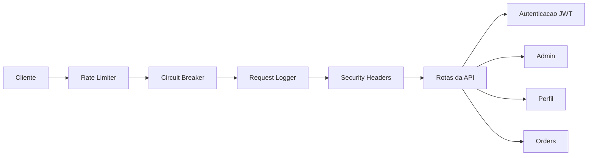
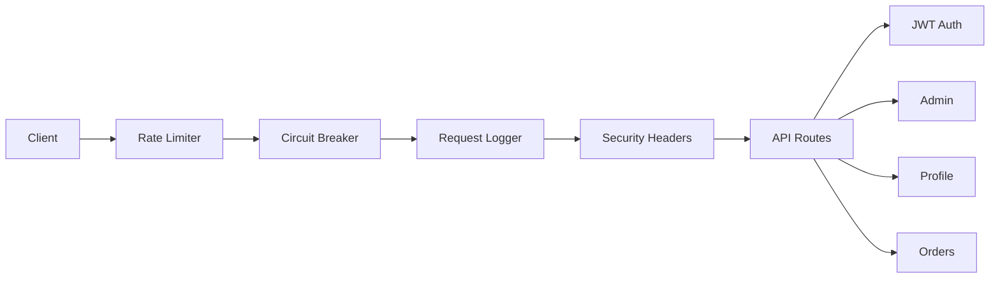

# Secure Financial API Gateway

API gateway para servicos financeiros, com autenticacao JWT, rate limiting, circuit breaker e headers de seguranca.

Financial services API gateway with JWT authentication, rate limiting, circuit breaker, and security headers.

[](https://www.python.org/)
[](https://fastapi.tiangolo.com/)
[](LICENSE)

[Portugues](#portugues) | [English](#english)

---

## Portugues

### Visao Geral

Gateway de API construido com FastAPI que implementa padroes comuns de seguranca para aplicacoes financeiras:

- **Autenticacao JWT** com access token (30 min) e refresh token (7 dias)
- **Controle de acesso por papel (RBAC)** com perfis de admin e usuario
- **Rate limiting** por IP usando algoritmo token bucket
- **Circuit breaker** por endpoint para evitar falhas em cascata
- **Headers de seguranca** seguindo recomendacoes OWASP (HSTS, CSP, X-Frame-Options, etc.)
- **Logging de requisicoes** com ID de rastreamento e tempo de processamento
- **Hashing de senhas** com bcrypt via Passlib

O projeto utiliza armazenamento em memoria para dados de usuarios (adequado para demonstracao e aprendizado). Para uso em producao, substitua por um banco de dados real e configure segredos adequados.

### Arquitetura



A pipeline de middleware processa cada requisicao na seguinte ordem:
1. **Circuit Breaker** — rejeita requisicoes se o endpoint estiver com taxa de erro alta
2. **Rate Limiter** — aplica limite de requisicoes por IP (token bucket)
3. **Request Logger** — registra metodo, path, status e duracao
4. **Security Headers** — adiciona headers de seguranca a resposta

### Endpoints da API

| Metodo | Endpoint | Descricao | Autenticacao |
|--------|----------|-----------|--------------|
| `GET` | `/` | Informacoes do servico | Nao |
| `GET` | `/health` | Health check | Nao |
| `POST` | `/api/v1/auth/login` | Login (retorna tokens JWT) | Nao |
| `POST` | `/api/v1/auth/register` | Registro de novo usuario | Nao |
| `POST` | `/api/v1/auth/refresh` | Renovar access token | Refresh token |
| `GET` | `/api/v1/auth/me` | Dados do usuario autenticado | Bearer token |
| `POST` | `/api/v1/auth/logout` | Logout (sem invalidacao server-side) | Bearer token |
| `GET` | `/api/v1/users/profile` | Perfil do usuario | Bearer token |
| `GET` | `/api/v1/trading/orders` | Listar orders (demo) | Bearer token |
| `GET` | `/api/v1/admin/users` | Listar usuarios (admin) | Bearer token (admin) |

### Inicio Rapido

```bash
# Clonar o repositorio
git clone https://github.com/galafis/secure-financial-api-gateway.git
cd secure-financial-api-gateway

# Criar e ativar ambiente virtual
python -m venv venv
source venv/bin/activate  # Windows: venv\Scripts\activate

# Instalar dependencias (producao)
pip install -r requirements.txt

# Instalar dependencias (desenvolvimento + testes)
pip install -r requirements-dev.txt

# Copiar variaveis de ambiente
cp .env.example .env

# Executar a aplicacao
make run
# ou diretamente:
python -m uvicorn src.main:app --reload --host 0.0.0.0 --port 8000
```

A documentacao interativa estara disponivel em `http://localhost:8000/api/docs` (Swagger) e `http://localhost:8000/api/redoc` (ReDoc).

### Docker

```bash
# Build e execucao
docker-compose up -d

# Ver logs
docker-compose logs -f

# Parar
docker-compose down
```

### Testes

```bash
# Executar todos os testes
make test

# Com relatorio de cobertura
make test-cov
```

### Estrutura do Projeto

```
secure-financial-api-gateway/
├── src/
│   ├── auth/
│   │   └── jwt_handler.py      # Geracao/validacao de JWT, hashing de senhas
│   ├── middleware/
│   │   ├── circuit_breaker.py   # Circuit breaker por endpoint
│   │   ├── rate_limiter.py      # Rate limiter com token bucket
│   │   ├── request_logger.py    # Log de requisicoes HTTP
│   │   └── security_headers.py  # Headers OWASP
│   ├── routes/
│   │   ├── admin_routes.py      # Endpoints administrativos
│   │   ├── auth_routes.py       # Login, registro, refresh, logout
│   │   ├── trading_routes.py    # Endpoints de trading (demo)
│   │   └── user_routes.py       # Perfil do usuario
│   ├── utils/
│   │   └── logger.py            # Configuracao de logger
│   └── main.py                  # Aplicacao FastAPI e middleware
├── tests/                       # Testes unitarios e de integracao
├── docs/                        # Documentacao adicional
├── Dockerfile
├── docker-compose.yml
├── requirements.txt             # Dependencias de producao
├── requirements-dev.txt         # Dependencias de desenvolvimento
├── Makefile
└── README.md
```

### Stack Tecnologica

| Tecnologia | Versao | Papel |
|------------|--------|-------|
| Python | 3.12 | Linguagem principal |
| FastAPI | 0.104+ | Framework web async |
| PyJWT | 2.8+ | Tokens JWT |
| Passlib + bcrypt | - | Hashing de senhas |
| Pydantic | 2.4+ | Validacao de dados |
| Uvicorn | 0.24+ | Servidor ASGI |
| Docker | - | Containerizacao |

### Limitacoes Conhecidas

- Armazenamento de usuarios em memoria (dados perdidos ao reiniciar)
- Logout nao invalida token server-side (tokens expiram naturalmente)
- Rate limiter e circuit breaker nao distribuidos (cada instancia tem estado isolado)
- Endpoints de trading sao placeholders (retornam dados vazios)

---

## English

### Overview

API gateway built with FastAPI that implements common security patterns for financial applications:

- **JWT authentication** with access tokens (30 min) and refresh tokens (7 days)
- **Role-based access control (RBAC)** with admin and user roles
- **Rate limiting** per IP using the token bucket algorithm
- **Circuit breaker** per endpoint to prevent cascading failures
- **Security headers** following OWASP recommendations (HSTS, CSP, X-Frame-Options, etc.)
- **Request logging** with tracing ID and processing time
- **Password hashing** with bcrypt via Passlib

The project uses in-memory storage for user data (suitable for demos and learning). For production use, swap in a real database and configure proper secrets.

### Architecture



The middleware pipeline processes each request in the following order:
1. **Circuit Breaker** -- rejects requests if the endpoint has a high error rate
2. **Rate Limiter** -- enforces per-IP request limits (token bucket)
3. **Request Logger** -- logs method, path, status code, and duration
4. **Security Headers** -- adds security headers to the response

### API Endpoints

| Method | Endpoint | Description | Auth |
|--------|----------|-------------|------|
| `GET` | `/` | Service info | No |
| `GET` | `/health` | Health check | No |
| `POST` | `/api/v1/auth/login` | Login (returns JWT tokens) | No |
| `POST` | `/api/v1/auth/register` | Register new user | No |
| `POST` | `/api/v1/auth/refresh` | Refresh access token | Refresh token |
| `GET` | `/api/v1/auth/me` | Authenticated user info | Bearer token |
| `POST` | `/api/v1/auth/logout` | Logout (no server-side invalidation) | Bearer token |
| `GET` | `/api/v1/users/profile` | User profile | Bearer token |
| `GET` | `/api/v1/trading/orders` | List orders (demo) | Bearer token |
| `GET` | `/api/v1/admin/users` | List users (admin only) | Bearer token (admin) |

### Quick Start

```bash
# Clone the repository
git clone https://github.com/galafis/secure-financial-api-gateway.git
cd secure-financial-api-gateway

# Create and activate virtual environment
python -m venv venv
source venv/bin/activate  # Windows: venv\Scripts\activate

# Install dependencies (production)
pip install -r requirements.txt

# Install dependencies (development + tests)
pip install -r requirements-dev.txt

# Copy environment variables
cp .env.example .env

# Run the application
make run
# or directly:
python -m uvicorn src.main:app --reload --host 0.0.0.0 --port 8000
```

Interactive documentation is available at `http://localhost:8000/api/docs` (Swagger) and `http://localhost:8000/api/redoc` (ReDoc).

### Docker

```bash
# Build and run
docker-compose up -d

# View logs
docker-compose logs -f

# Stop
docker-compose down
```

### Tests

```bash
# Run all tests
make test

# With coverage report
make test-cov
```

### Project Structure

```
secure-financial-api-gateway/
├── src/
│   ├── auth/
│   │   └── jwt_handler.py      # JWT generation/validation, password hashing
│   ├── middleware/
│   │   ├── circuit_breaker.py   # Per-endpoint circuit breaker
│   │   ├── rate_limiter.py      # Token bucket rate limiter
│   │   ├── request_logger.py    # HTTP request logging
│   │   └── security_headers.py  # OWASP security headers
│   ├── routes/
│   │   ├── admin_routes.py      # Admin endpoints
│   │   ├── auth_routes.py       # Login, register, refresh, logout
│   │   ├── trading_routes.py    # Trading endpoints (demo)
│   │   └── user_routes.py       # User profile
│   ├── utils/
│   │   └── logger.py            # Logger setup
│   └── main.py                  # FastAPI app and middleware
├── tests/                       # Unit and integration tests
├── docs/                        # Additional documentation
├── Dockerfile
├── docker-compose.yml
├── requirements.txt             # Production dependencies
├── requirements-dev.txt         # Development dependencies
├── Makefile
└── README.md
```

### Tech Stack

| Technology | Version | Role |
|------------|---------|------|
| Python | 3.12 | Core language |
| FastAPI | 0.104+ | Async web framework |
| PyJWT | 2.8+ | JWT tokens |
| Passlib + bcrypt | - | Password hashing |
| Pydantic | 2.4+ | Data validation |
| Uvicorn | 0.24+ | ASGI server |
| Docker | - | Containerization |

### Known Limitations

- In-memory user storage (data lost on restart)
- Logout does not invalidate token server-side (tokens expire naturally)
- Rate limiter and circuit breaker are not distributed (each instance has isolated state)
- Trading endpoints are placeholders (return empty data)

---

## Author / Autor

**Gabriel Demetrios Lafis**
- GitHub: [@galafis](https://github.com/galafis)
- LinkedIn: [Gabriel Demetrios Lafis](https://linkedin.com/in/gabriel-demetrios-lafis)

## License / Licenca

This project is licensed under the MIT License - see the [LICENSE](LICENSE) file for details.

Este projeto esta licenciado sob a Licenca MIT - veja o arquivo [LICENSE](LICENSE) para detalhes.
