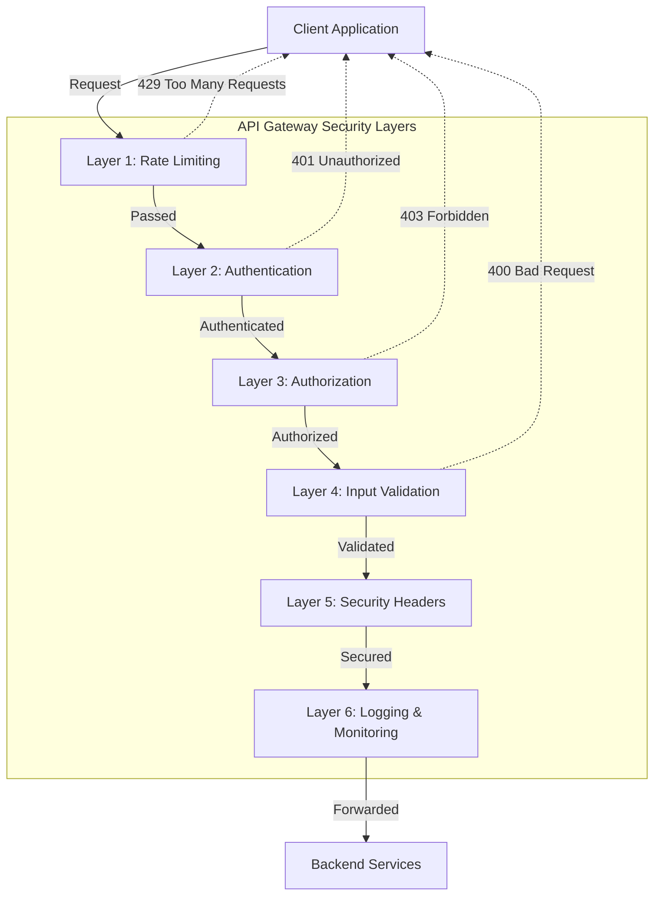
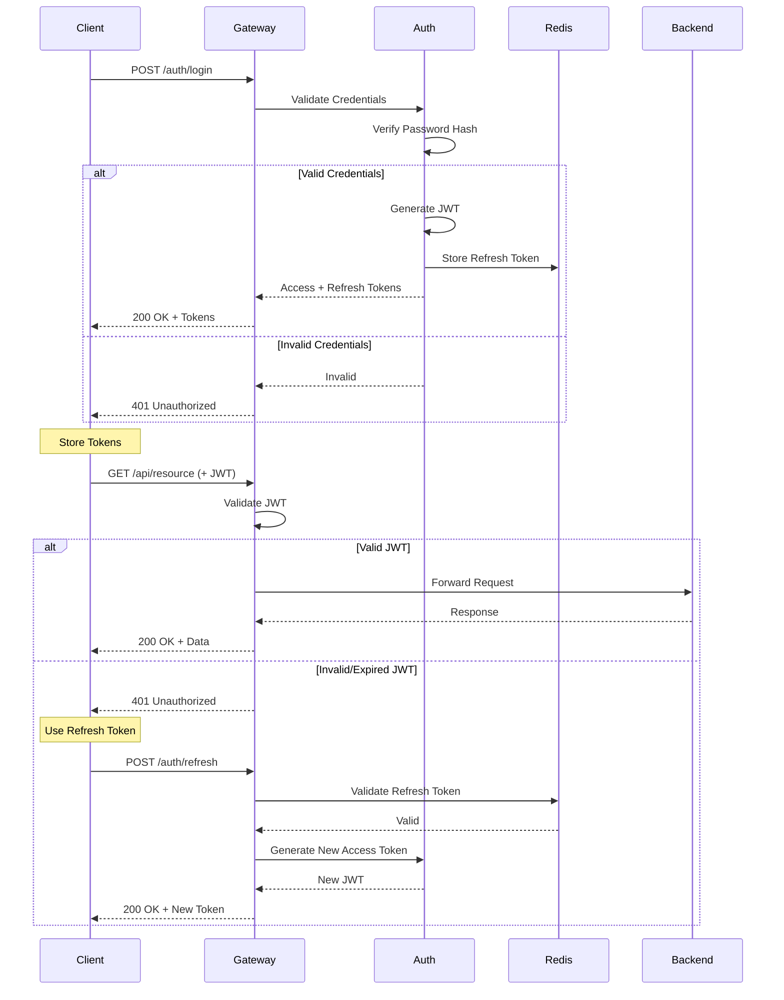
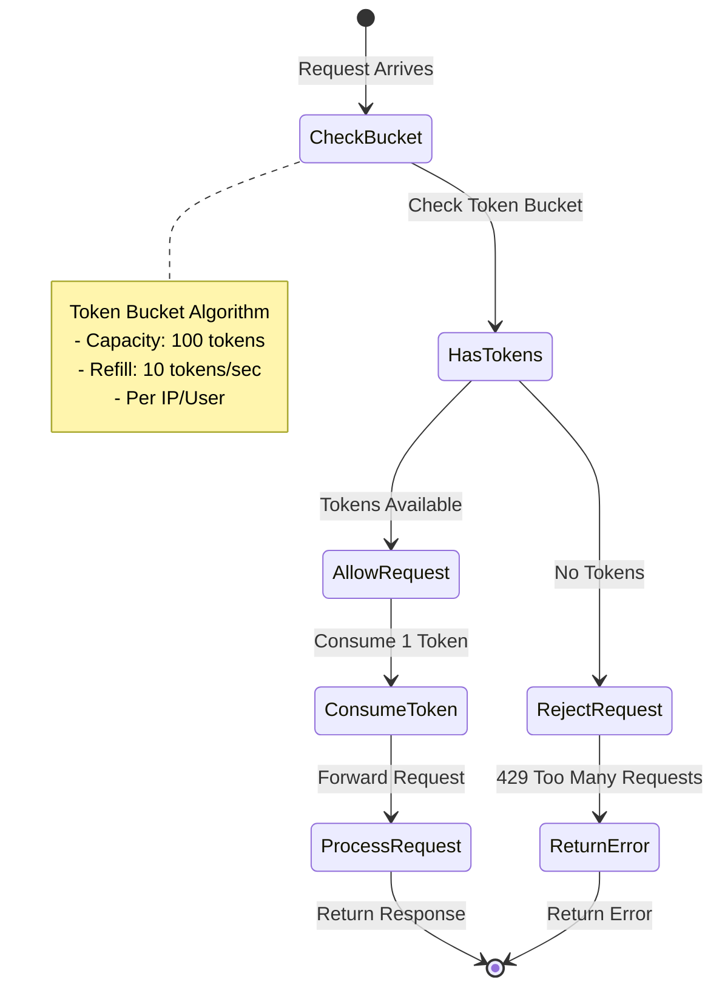
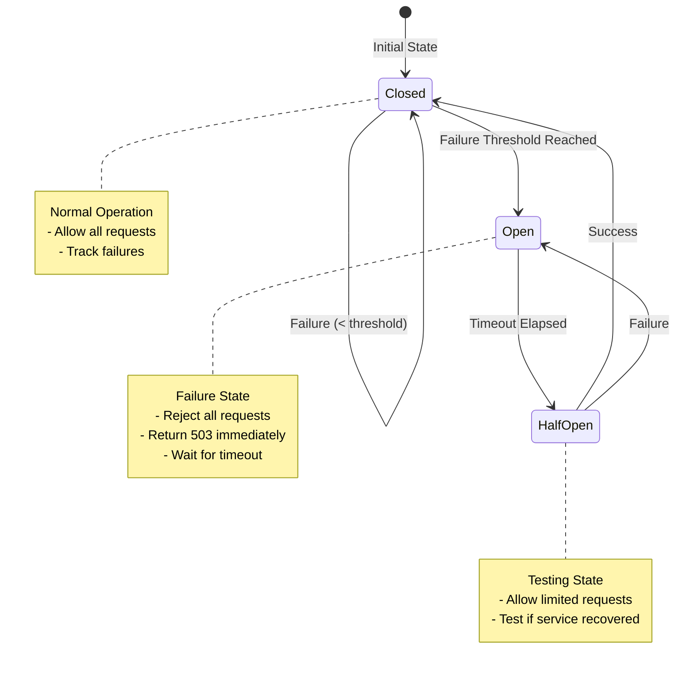
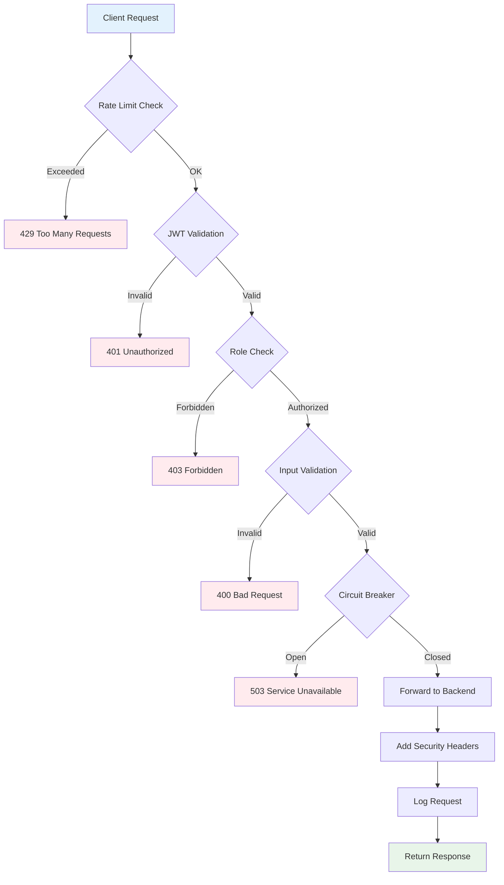
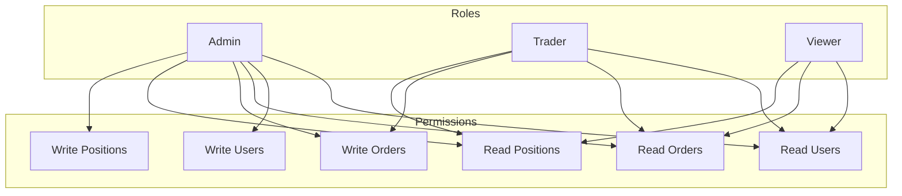
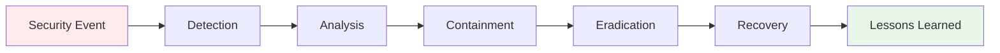

# 🔐 Security Architecture Documentation

## Security Layers



## Authentication Flow



## Rate Limiting Strategy



## Circuit Breaker Pattern



## Security Components

### 1. JWT Authentication

```python
# JWT Structure
{
    "header": {
        "alg": "HS256",
        "typ": "JWT"
    },
    "payload": {
        "user_id": 123,
        "username": "john_doe",
        "role": "trader",
        "exp": 1699999999,
        "iat": 1699996399
    },
    "signature": "..."
}
```

**Token Lifecycle:**
- **Access Token**: 1 hour expiration
- **Refresh Token**: 7 days expiration
- **Rotation**: New refresh token on each refresh

### 2. Password Security

```python
# Bcrypt with salt
password_hash = bcrypt.hashpw(
    password.encode('utf-8'),
    bcrypt.gensalt(rounds=12)
)

# Verification
is_valid = bcrypt.checkpw(
    password.encode('utf-8'),
    stored_hash
)
```

**Password Requirements:**
- Minimum 8 characters
- At least 1 uppercase letter
- At least 1 lowercase letter
- At least 1 digit
- At least 1 special character

### 3. Rate Limiting

```python
# Token Bucket Algorithm
class TokenBucket:
    capacity = 100      # Maximum tokens
    refill_rate = 10    # Tokens per second
    tokens = 100        # Current tokens
    last_refill = now()
    
    def consume(self, tokens=1):
        self.refill()
        if self.tokens >= tokens:
            self.tokens -= tokens
            return True
        return False
```

**Rate Limits:**
- **Anonymous**: 10 req/min
- **Authenticated**: 100 req/min
- **Premium**: 1000 req/min

### 4. Security Headers

```python
headers = {
    "X-Content-Type-Options": "nosniff",
    "X-Frame-Options": "DENY",
    "X-XSS-Protection": "1; mode=block",
    "Strict-Transport-Security": "max-age=31536000; includeSubDomains",
    "Content-Security-Policy": "default-src 'self'",
    "Referrer-Policy": "strict-origin-when-cross-origin"
}
```

## OWASP Top 10 Mitigation

| Vulnerability | Mitigation | Implementation |
|---------------|------------|----------------|
| **A01: Broken Access Control** | RBAC + JWT | Role-based endpoints |
| **A02: Cryptographic Failures** | TLS 1.3 + Bcrypt | HTTPS only, password hashing |
| **A03: Injection** | Input validation | Pydantic models |
| **A04: Insecure Design** | Security by design | Multiple security layers |
| **A05: Security Misconfiguration** | Security headers | OWASP headers |
| **A06: Vulnerable Components** | Dependency scanning | Regular updates |
| **A07: Auth Failures** | JWT + MFA ready | Secure token management |
| **A08: Data Integrity Failures** | Request signing | HMAC verification |
| **A09: Logging Failures** | Comprehensive logging | All requests logged |
| **A10: SSRF** | URL validation | Whitelist approach |

## Request Flow with Security



## Role-Based Access Control (RBAC)



## Endpoint Security Matrix

| Endpoint | Method | Auth Required | Rate Limit | Roles Allowed |
|----------|--------|---------------|------------|---------------|
| `/auth/register` | POST | No | 5/min | - |
| `/auth/login` | POST | No | 10/min | - |
| `/auth/refresh` | POST | Yes (Refresh) | 20/min | All |
| `/users/me` | GET | Yes | 100/min | All |
| `/users/{id}` | GET | Yes | 100/min | Admin |
| `/orders` | GET | Yes | 100/min | Trader, Admin |
| `/orders` | POST | Yes | 50/min | Trader, Admin |
| `/admin/users` | GET | Yes | 100/min | Admin |

## Monitoring & Alerts

### Security Metrics

```python
# Metrics to track
security_metrics = {
    "failed_login_attempts": Counter,
    "rate_limit_hits": Counter,
    "jwt_validation_failures": Counter,
    "circuit_breaker_opens": Counter,
    "suspicious_requests": Counter
}
```

### Alert Rules

```yaml
- alert: HighFailedLoginRate
  expr: rate(failed_login_attempts[5m]) > 10
  annotations:
    summary: "Possible brute force attack"
    
- alert: ExcessiveRateLimiting
  expr: rate(rate_limit_hits[5m]) > 100
  annotations:
    summary: "Possible DDoS attack"
    
- alert: CircuitBreakerOpen
  expr: circuit_breaker_state == 1
  for: 5m
  annotations:
    summary: "Backend service degraded"
```

## Security Best Practices

### 1. Token Management
```python
# ✅ Good: Store in httpOnly cookie
response.set_cookie(
    "access_token",
    token,
    httponly=True,
    secure=True,
    samesite="strict"
)

# ❌ Bad: Store in localStorage
localStorage.setItem("token", token)
```

### 2. Password Validation
```python
# ✅ Good: Strong password policy
def validate_password(password):
    if len(password) < 8:
        return False
    if not re.search(r"[A-Z]", password):
        return False
    if not re.search(r"[a-z]", password):
        return False
    if not re.search(r"\d", password):
        return False
    if not re.search(r"[!@#$%^&*]", password):
        return False
    return True
```

### 3. Input Sanitization
```python
# ✅ Good: Use Pydantic models
class UserCreate(BaseModel):
    username: str = Field(..., min_length=3, max_length=50)
    email: EmailStr
    password: str = Field(..., min_length=8)
```

## Incident Response



## Compliance

### GDPR
- Data encryption at rest and in transit
- Right to be forgotten (user deletion)
- Data portability
- Consent management

### PCI DSS (if handling payments)
- No storage of CVV
- Tokenization of card data
- Regular security audits
- Network segmentation

## Security Checklist

- [x] HTTPS only (TLS 1.3)
- [x] JWT authentication
- [x] Password hashing (bcrypt)
- [x] Rate limiting
- [x] Input validation
- [x] Security headers
- [x] CORS configuration
- [x] Circuit breaker
- [x] Request logging
- [x] Error handling (no sensitive data)
- [x] Dependency scanning
- [x] Regular updates
